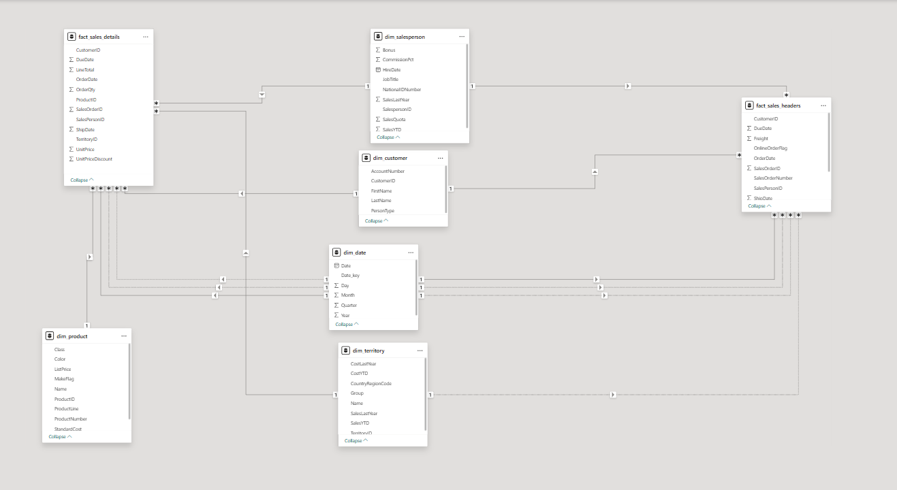

# Day 22: Power BI

Day 22 introduced Power BI through data preparation in **Power Query** and relational data modeling. The instructor demonstrated how the analysis could be designed around a single fact table, while this solution develops the model further by separating sales headers and sales details into two fact tables.

---

## Learning Objectives

- Import and prepare data with Power Query.
- Apply transformations before loading data into the model.
- Identify the difference between fact tables and dimension tables.
- Build relationships between multiple fact tables and shared dimensions.
- Design a Power BI model that supports reusable sales analysis.

---

## Instructor Approach

The instructor explained a model based on one fact table and showed the process of transforming the source data in Power Query. This approach keeps the model straightforward and can be suitable when the required analysis is centered on one consistent business process.

As an extension of that approach, this solution uses two fact tables. The split separates order-level information from line-level sales information and provides a clearer structure for analyzing both types of data.

---

## My Data Model

The submitted model contains the following tables:

### Fact Tables

- `fact_sales_headers`: Order-level attributes such as order date, customer, salesperson, shipping information, and online-order status.
- `fact_sales_details`: Line-level sales measures and identifiers such as order date, product, quantity, sales amount, unit price, discount, salesperson, customer, and territory.

### Dimension Tables

- `dim_customer`: Customer and account information.
- `dim_date`: Date attributes including day, month, quarter, and year.
- `dim_product`: Product attributes such as class, color, price, category, and product identifiers.
- `dim_salesperson`: Salesperson, job, territory, quota, and sales information.
- `dim_territory`: Territory, country, region, group, and sales territory attributes.

The shared dimensions allow both fact tables to be filtered consistently in reports. The model follows a star-schema direction while preserving the distinction between order headers and order details.

---

## Power Query Work

The practical work focused on preparing the source data before analysis. The transformation stage was used to shape the tables, keep the required columns, and prepare compatible keys and fields for the relationships in the model.

The main workflow was:

1. Load the source data into Power BI.
2. Transform and organize the data in Power Query.
3. Separate header-level and detail-level sales data.
4. Prepare dimension tables for filtering and grouping.
5. Create relationships between the fact tables and shared dimensions.
6. Validate the model for future report and measure development.

---

## Files

- [Lab_solution.pbix](Lab_solution.pbix): Power BI solution containing the transformed data model.
- [2_facts_data_model.png](2_facts_data_model.png): Screenshot of the two-fact data model.

> No separate lab file was provided for this day. The instructor worked through the Power Query transformations and data-model design during the session, so this folder contains the completed solution and the model image.

---

## Outcome

By the end of Day 22, I practiced preparing data in Power Query and building a Power BI model with two fact tables and shared dimensions. The solution extends the instructor's one-fact example by separating sales header data from sales detail data, making the grain of each fact table more explicit for analysis.
